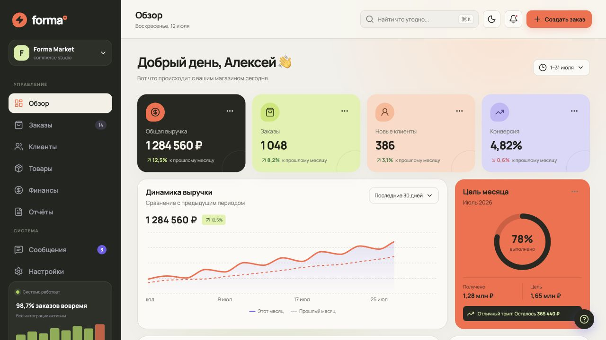

# Forma Admin



Концепт современной панели управления интернет-магазином. Проект выполнен как самостоятельная UI-работа: выразительная editorial-стилистика, адаптивная компоновка, аналитический дашборд и основные сценарии админ-панели.

> **Статус:** frontend-концепт. Интерфейс использует демонстрационные данные и не подключён к серверу или базе данных.

## Возможности

- дашборд с ключевыми показателями и графиком выручки;
- список заказов и статусы обработки;
- виджет месячной цели и операционные показатели;
- разделы клиентов, товаров, финансов и отчётов;
- форма создания заказа;
- панель уведомлений;
- светлая и тёмная темы;
- адаптивная навигация и мобильная компоновка.

## Визуальная концепция

Forma намеренно отличается от типичных фиолетово-синих SaaS-интерфейсов. В основе дизайна — тёплый нейтральный фон, графитовый сайдбар, коралловый акцент и контрастные лаймовые состояния. Крупные скругления, асимметричные карточки и спокойная типографика создают ощущение редакционного digital-продукта.

Подробнее о визуальной системе и принятых решениях: [docs/DESIGN.md](./docs/DESIGN.md).

## Технологии

- React 19;
- TypeScript;
- Vite;
- Recharts;
- Lucide React;
- CSS без UI-фреймворка.

## Быстрый старт

Требуется Node.js 20 или новее.

```bash
git clone https://github.com/Amir213902/admin-panel.git
cd admin-panel
npm install
npm run dev
```

После запуска приложение будет доступно по адресу `http://localhost:5173`.

## Команды

| Команда | Назначение |
| --- | --- |
| `npm run dev` | Запуск локального сервера разработки |
| `npm run build` | Проверка TypeScript и production-сборка |
| `npm run preview` | Просмотр собранной production-версии |

## Структура

```text
admin-panel/
├── docs/
│   └── DESIGN.md       # дизайн-концепция и UI-принципы
├── src/
│   ├── App.tsx         # экраны, компоненты и демоданные
│   ├── main.tsx        # точка входа
│   └── styles.css      # дизайн-система и адаптивность
├── forma-admin-preview.png
├── index.html
└── package.json
```

## Ограничения прототипа

Проект демонстрирует вёрстку и взаимодействия интерфейса. Авторизация, маршрутизация, API, постоянное хранение данных, полноценная фильтрация и серверные операции не реализованы.

## Возможное развитие

1. Разделить приложение на маршруты и независимые компоненты.
2. Подключить API и хранение данных.
3. Реализовать полный сценарий обработки заказа.
4. Добавить авторизацию и ролевую модель.
5. Покрыть ключевые сценарии автоматическими тестами.

---

Designed and built as a frontend portfolio concept.
